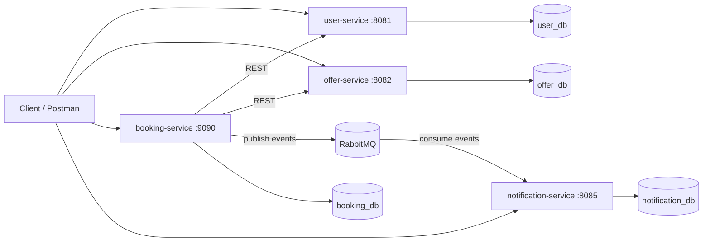
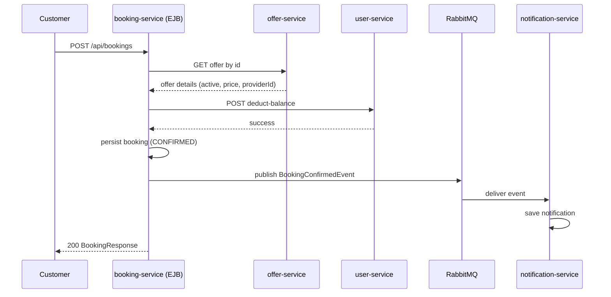
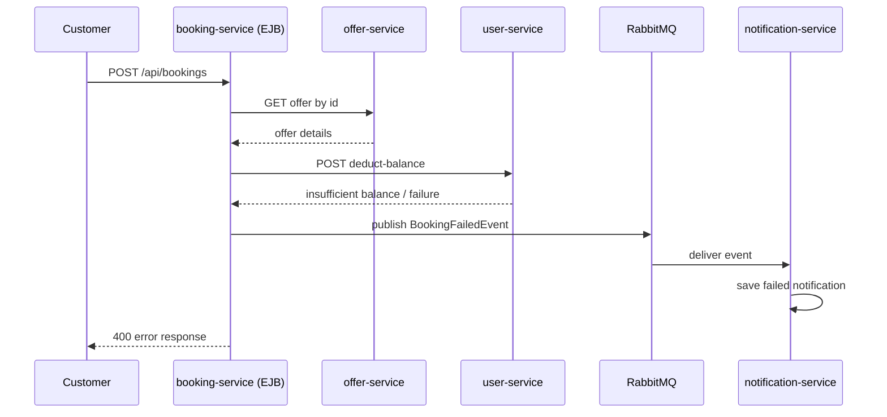

# On-Demand Home Services Marketplace Platform

Distributed Systems Assignment 2 (Winter 2026)

## 1) Project Overview

This project is a microservices-based marketplace where customers book home services (plumbing, carpentry, electrical, etc.) from providers.  
It is built to demonstrate:

- Service decomposition and API-based communication
- Database-per-service isolation
- EJB usage in one service (`booking-service`)
- Asynchronous messaging with RabbitMQ
- End-to-end booking workflow with notifications

## 2) System Architecture

The platform uses 4 microservices:

1. `user-service` (Spring Boot, port `8081`)
2. `offer-service` (Spring Boot, port `8082`)
3. `booking-service` (Jakarta EE + WildFly + EJB, port `9090`)
4. `notification-service` (Spring Boot, port `8085`)

### High-level Architecture (Mermaid)



### ASCII Overview

```text
Client/Postman
   |--> user-service (Spring Boot) --------> user_db
   |--> offer-service (Spring Boot) -------> offer_db
   |--> booking-service (WildFly/EJB) -----> booking_db
   |--> notification-service (Spring Boot) -> notification_db

booking-service --REST--> user-service / offer-service
booking-service --RabbitMQ publish--> booking.events.exchange
notification-service <--RabbitMQ consume-- booking.confirmed.queue / booking.failed.queue
```

## 3) Microservices Explanation

Each service is responsible for a clear business domain:

- `user-service`: registration, authentication, roles, wallet/balance operations
- `offer-service`: service offers and categories
- `booking-service`: booking orchestration and booking records
- `notification-service`: asynchronous notification persistence and retrieval

## 4) Why Microservices Were Used

- Separation of concerns for each domain
- Independent data ownership
- Easier team collaboration
- Clear service boundaries (good for distributed systems assignments)
- Easy to show inter-service communication over REST

## 5) Why RabbitMQ Was Used

RabbitMQ was used to implement asynchronous communication required by the assignment:

- `booking-service` publishes booking events
- `notification-service` consumes events and stores notifications

This decouples notification logic from the booking transaction path.

## 6) Why EJB Was Used

The assignment requires EJB usage in at least one service.  
`booking-service` uses Jakarta EE/WildFly EJBs:

- `@Stateless` Session Beans (business logic/repository/services)
- `@Singleton` Bean (`RabbitMqPublisher`)

This satisfies the EJB-type requirement in a simple and academic way.

## 7) Clean Architecture Explanation

The services follow layered structure (adapted to each framework):

- Controller/API layer: receives HTTP requests only
- Use-case/service layer: business logic
- Repository/persistence layer: database access
- DTOs: API contracts
- Exception handlers: centralized error responses

Business rules are kept out of controllers.

## 8) Communication Between Services

- `booking-service -> offer-service`:
  - fetch offer details and availability
- `booking-service -> user-service`:
  - deduct wallet balance
- `booking-service -> RabbitMQ`:
  - publish booking events
- `notification-service <- RabbitMQ`:
  - consume and persist notifications

Only REST and messaging are used across service boundaries.

## 9) Database-Per-Service Explanation

Each service has an isolated database:

- `home_services_platform_user_db`
- `home_services_platform_offer_db`
- `home_services_platform_booking_db`
- `home_services_platform_notification_db`

No service directly reads/writes another service’s DB.  
All cross-service data is fetched through REST APIs.

## 10) Event-Driven Architecture Explanation

Events used:

- `BookingConfirmedEvent`
- `BookingFailedEvent`

RabbitMQ configuration:

- Exchange: `booking.events.exchange` (direct)
- Queues:
  - `booking.confirmed.queue`
  - `booking.failed.queue`
- Routing keys:
  - `booking.confirmed`
  - `booking.failed`

## 11) Technologies Used

- Java 17
- Spring Boot
- Jakarta EE (JAX-RS, EJB, JPA) on WildFly
- PostgreSQL
- RabbitMQ
- Docker / Docker Compose
- REST APIs
- Postman

## 12) Folder Structure (High Level)

```text
home-services-platform/
├─ user-service/
├─ offer-service/
├─ booking-service/
├─ notification-service/
├─ docker-compose.yml
└─ rabbitmq/
   ├─ rabbitmq.conf
   └─ definitions.json
```

## 13) API Endpoints Summary

### user-service (`http://localhost:8081`)

- `POST /api/users/register`
- `POST /api/users/login`
- `GET /api/users` (admin)
- `GET /api/users/{id}`
- `GET /api/users/{id}/balance`
- `POST /api/users/{id}/add-balance`
- `POST /api/users/{id}/deduct-balance`

### offer-service (`http://localhost:8082`)

- `POST /api/offers`
- `GET /api/offers`
- `GET /api/offers/{id}`
- `GET /api/offers/category/{category}`
- `PUT /api/offers/{id}`
- `POST /api/offers/categories` (admin)
- `GET /api/offers/categories` (admin)

### booking-service (`http://localhost:9090/booking-service-1.0-SNAPSHOT`)

- `POST /api/bookings`
- `GET /api/bookings` (admin)
- `GET /api/bookings/{id}`
- `GET /api/bookings/customer/{customerId}`
- `GET /api/bookings/provider/{providerId}`
- `GET /api/bookings/provider/{providerId}/completed`
- `PUT /api/bookings/{id}/status`

### notification-service (`http://localhost:8085`)

- `GET /api/notifications`
- `GET /api/notifications/customer/{customerId}`
- `GET /api/notifications/provider/{providerId}`

## 14) How to Run from Scratch

## 15) Docker Setup

1. Install Docker Desktop
2. From project root:
   - `docker compose up -d`
3. Confirm RabbitMQ container is running:
   - `docker ps`

## 16) RabbitMQ Setup

- UI: [http://localhost:15672](http://localhost:15672)
- Username: `guest`
- Password: `guest`
- Verify in UI:
  - Exchange `booking.events.exchange`
  - Queues `booking.confirmed.queue`, `booking.failed.queue`
  - Bindings to routing keys exist

## 17) WildFly Deployment Steps (booking-service)

1. Build WAR:
   - `booking-service/mvnw.cmd clean package -DskipTests`
2. Deploy to WildFly:
   - copy WAR from `booking-service/target/*.war` into `WILDFLY_HOME/standalone/deployments/`
3. Ensure WildFly is running.
4. Verify:
   - `http://localhost:9090/booking-service-1.0-SNAPSHOT/api/bookings/health`

## 18) PostgreSQL Setup

Create databases:

- `home_services_platform_user_db`
- `home_services_platform_offer_db`
- `home_services_platform_booking_db`
- `home_services_platform_notification_db`

Ensure service credentials in each `application.properties` / datasource config are correct.

## 19) Postman Collection Usage

1. Import your Postman collection (or create new collection with folders per service).
2. Create environment variables:
   - `userBase = http://localhost:8081`
   - `offerBase = http://localhost:8082`
   - `bookingBase = http://localhost:9090/booking-service-1.0-SNAPSHOT`
   - `notificationBase = http://localhost:8085`
3. For admin-protected endpoints, configure Basic Auth:
   - `admin / admin123`

## 20) Complete Testing Scenario

1. Register provider + customer
2. Add wallet balance to customer
3. Create category
4. Provider creates offer
5. Customer books service
6. Verify:
   - booking created
   - wallet deducted
   - RabbitMQ event published
   - notification stored and retrievable
7. Try failed booking path (insufficient balance or unavailable offer)
8. Verify failed notification stored

## 21) Example Successful Booking Flow



## 22) Example Failed Booking Flow



## 23) Screenshots (Placeholders)

Add screenshots in report or repository docs:

- [ ] System architecture diagram
- [ ] RabbitMQ Exchanges/Queues UI
- [ ] Successful booking API response
- [ ] Failed booking API response
- [ ] Notifications API response
- [ ] Databases tables (bookings/notifications)

## 24) Future Improvements

- Add JWT-based authentication/authorization
- Add retry/dead-letter queues for failed consumers
- Add centralized logging and tracing
- Add integration tests for cross-service workflows
- Add API gateway and service discovery (optional advanced)

## 25) Team Members

> Replace placeholders before submission:

- Member 1: `Full Name - ID`
- Member 2: `Full Name - ID`

---

## Assignment Requirement Mapping (Team of 2 Scope)

- Core microservices implemented ✅
- EJB usage in booking-service ✅
- REST integration between services ✅
- Wallet check + booking rules ✅
- RabbitMQ async booking events ✅
- Notification service consuming events ✅
- Team-of-3 optional features intentionally excluded ✅

---

If you want, I can also generate a separate `RUNBOOK.md` with exact one-command startup for TA evaluation and a `POSTMAN_TEST_PLAN.md` with request-by-request expected JSON.
